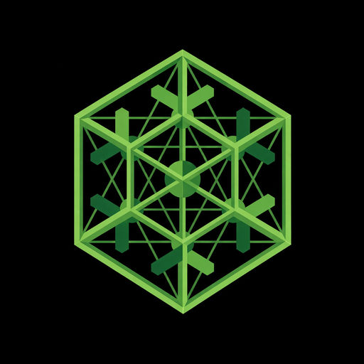

<p align="center">
  <a href="https://github.com/VirtualMachinist/Omahedron">
    
  </a>
</p>

<h1 align="center">Omahedron</h1>

<p align="center">
  <strong>Trailing-stable Omarchy vendor port for NixOS.</strong><br>
</p>

<p align="center">
  <a href="https://github.com/VirtualMachinist/Omahedron/actions/workflows/ci.yml"></a>
  <a href="https://github.com/VirtualMachinist/Omahedron/releases/latest"></a>
  <a href="https://github.com/basecamp/omarchy/releases/tag/v4.0.3"></a>
  <a href="https://nixos.org"></a>
  <a href="https://github.com/hyprwm/Hyprland/releases/tag/v0.56.2"></a>
  <a href="LICENSE"></a>
  <a href="https://hedronite.com"></a>
  <a href="https://x.com/Hedronite"></a>
</p>

<p align="center">
  <a href="#quick-start">Quick start</a> ·
  <a href="#daily-drive">Daily drive</a> ·
  <a href="#what-you-get">What you get</a> ·
  <a href="#omachron-the-release-schedule">Omachron</a> ·
  <a href="#how-it-works">How it works</a> ·
  <a href="docs/install.md">Install guide</a> ·
  <a href="docs/options.md">Options</a> ·
  <a href="docs/COMPETE.md">Compete</a> ·
  <a href="schema/scorecard.json">Scorecard</a> ·
  <a href="https://github.com/VirtualMachinist/Omahedron/releases">Releases</a> ·
  <a href="#contributing">Contributing</a>
</p>

<p align="center">
  Built by <a href="https://hedronite.com">Hedronite</a>'s <a href="https://x.com/Hedronite">VirtualMachinist</a>.
  Desktop by <a href="https://omarchy.org">Omarchy</a>. Not affiliated with Omarchy, Omacom, or 37signals.
</p>

---

> **Status:** In production use as a daily-driver / dogfood NixOS desktop (Omarchy trailing-stable port). Hardening: release scorecard, install docs, and CI continue to track pinned Omarchy/Hyprland. Not a toy reference.


Omahedron is the [Omarchy](https://omarchy.org) desktop running on NixOS: Hyprland session, Quickshell bar, launcher, menus, lock screen, twenty-two stock themes with live swap, keybindings, and `omarchy-*` commands — vendored from the pinned upstream tag into the Nix store.

It exists for **Omarchs who want NixOS underneath**: declarative configuration, atomic upgrades, and rollback to any previous generation from the boot menu. If Arch's pace is the one thing keeping you off Omarchy, this is the way in. If you already run NixOS and want Omarchy's desktop without maintaining a rice, this is the way in too.

Omahedron is not a competing distro and not a rewrite. Unofficial. Not Basecamp, not 37signals, not Omacom.

**Follow a pin.** Latest GitHub Release: [`omahedron-4.0.3`](https://github.com/VirtualMachinist/Omahedron/releases/tag/omahedron-4.0.3) (Omarchy v4.0.3 @ `0534987`).

Once it is running you drive it with **`omarchy`**, the same command center as Arch Omarchy. You do not open `flake.nix` or `configuration.nix` to theme, add packages, update, or roll back. Nix stays underneath so generations and undo still work.

**444** upstream commands classified in [`schema/scripts.lock.json`](schema/scripts.lock.json) at pin [`v4.0.3`](schema/pin.json) (341 vendor · 33 wrap · 70 stub · plus pacman policy row) · **206** upstream packages mapped · **22** CI checks · **3** VM test suites · **1** Quickshell process

## Daily drive

Humans type `omarchy`. Agents edit Nix. That split is the [oma-cli](docs/oma-cli.md) workstream — there is no second CLI brand.

```sh
omarchy theme set tokyo-night
omarchy pkg add cowsay
omarchy update
omarchy rollback
omarchy pin omahedron-4.0.3
omarchy setup name "Ada Lovelace"
```

The Omarchy menus do the same work. Each verb writes your flake and rebuilds; you never have to look at the file. Identity, profile, unfree, terminal, fingerprint, and autologin are `omarchy setup …` — see [install: no Nix editing](docs/install.md#changing-system-options-no-nix-editing).

`omarchy rollback` is the previous NixOS generation. It does not roll back `$HOME`.

## Quick start

On an existing NixOS box, `omarchy setup` writes the consumer flake, copies `hardware-configuration.nix`, and rebuilds. You do not hand-edit Nix for that first switch. The [install guide](docs/install.md) has the wizard questions, the fresh-machine walkthrough, and the first-build cache tip.

If you are an agent wiring the flake by hand (or `omarchy setup` is not on PATH yet), this is the one-time module import:

**1. Add Omahedron to your flake.**

Pin the last tagged release:

```nix
{
  inputs = {
    nixpkgs.url = "github:NixOS/nixpkgs/nixos-26.05";
    # Followable product tag (Omarchy v4.0.3):
    omahedron.url = "github:VirtualMachinist/Omahedron/omahedron-4.0.3";
    # Or track branch head:
    # omahedron.url = "github:VirtualMachinist/Omahedron/main";
  };

  outputs = { nixpkgs, omahedron, ... }: {
    nixosConfigurations.mybox = nixpkgs.lib.nixosSystem {
      system = "x86_64-linux";
      modules = [
        ./hardware-configuration.nix
        ./configuration.nix
        omahedron.nixosModules.default
        omahedron.inputs.home-manager.nixosModules.home-manager
        { home-manager.sharedModules = [ omahedron.homeManagerModules.default ]; }
      ];
    };
  };
}
```

**2. Turn it on in `configuration.nix`.**

```nix
{ pkgs, ... }:
{
  networking.hostName = "mybox";   # must match the nixosConfigurations key above
  nix.settings.experimental-features = [ "nix-command" "flakes" ];

  omarchy.enable = true;
  omarchy.full_name = "Ada Lovelace";
  omarchy.email_address = "ada@example.com";
  omarchy.timezone = "Europe/London";
  omarchy.theme = "tokyo-night";    # any of the 22 stock themes
  omarchy.terminal = "ghostty";     # foot, ghostty, alacritty, or kitty

  # Packages installed from the Omarchy menus land here, declaratively.
  omarchy.managedPackagesFile =
    if builtins.pathExists ./omarchy-packages.json then ./omarchy-packages.json else null;

  users.users.ada = {
    isNormalUser = true;
    extraGroups = [ "wheel" "video" "input" "networkmanager" ];
    initialHashedPassword = "…";    # mkpasswd -m sha-512
  };

  home-manager.users.ada = {
    home.username = "ada";
    home.homeDirectory = "/home/ada";
    home.stateVersion = "26.05";
    omarchy.enable = true;
  };

  boot.loader.systemd-boot.enable = true;
  boot.loader.efi.canTouchEfiVariables = true;
  system.stateVersion = "26.05";
}
```

**3. Build, reboot, log in.**

```sh
sudo nixos-rebuild switch --flake /etc/nixos#mybox
```

Log in at the SDDM greeter, press <kbd>Super</kbd>+<kbd>Enter</kbd>, and you are in Omarchy. After that, stay on [Daily drive](#daily-drive). The full option surface is in [docs/options.md](docs/options.md); the reference configuration this repo tests against is [example/configuration.nix](example/configuration.nix).

> [!TIP]
> The very first build pulls a pinned Hyprland from the Hyprland binary cache once the module has registered it. On a brand-new machine that registration lands in the same switch, so pass the cache on the command line the first time to avoid compiling Hyprland from source. The [install guide](docs/install.md#first-build-use-the-hyprland-cache) shows the one-liner.

## What you get

Everything below is Omarchy's own code, running from the Nix store.

| | Omarchy on Arch | Omahedron on NixOS |
|---|---|---|
| Compositor | Hyprland 0.56 with the Lua bootstrap | Same Hyprland, pinned at 0.56.2, with the same Lua bootstrap and your overrides in `~/.config/hypr` |
| Shell | One Quickshell process for bar, launcher, menus, notifications, OSDs, lock, polkit | The same single Quickshell process |
| Themes | 22 stock themes, TOML plus templates, live swap | Same engine, same themes, same live swap, plus your own under `~/.config/omarchy/themes` |
| Commands | `omarchy-*` scripts on `PATH` | Same scripts on `PATH`, sourced from the pinned upstream tag |
| Shell | Fish by default, Bash for scripts | Same, with an opt-out |
| First run | Interactive identity prompt | `omarchy setup` asks once and writes Nix; no prompt you maintain |
| Apps | Omarchy-owned apps from the Omarchy repo | The same apps packaged under `pkgs/` when nixpkgs lacks them |
| Update | `omarchy update` | The same menu entry runs `nix flake update` and `nixos-rebuild switch` |
| Install / Remove menus | pacman and yay | Writes `omarchy-packages.json` in your flake and rebuilds, so every install is declarative and rollback-safe |
| Undo | Snapper snapshots | Every generation in the boot menu |

### What stays on Arch, on purpose

Omahedron rebuilds the desktop layer. The operating-system layer belongs to NixOS, and every place the two meet is written down rather than papered over. The full ledger lives in [docs/COMPAT.md](docs/COMPAT.md) with a machine-readable copy in [schema/](schema/) that CI enforces.

| Upstream | On Omahedron |
|---|---|
| pacman, yay, AUR, pkgs.omarchy.org | Flake packages and a rebuild. Never a host pacman. |
| Limine, Snapper, mkinitcpio UKI | systemd-boot and NixOS generations |
| The Omarchy ISO (Arch), `omarchy-apply-system`, `omarchy-apply-hardware` as Arch chroot helpers | `omarchy setup` on an existing NixOS ([docs/oma-cli.md](docs/oma-cli.md)). A NixOS-shaped Omahedron ISO is in product and does not ship on this tag. |
| The Omarchy Kernel as an Arch package | The kernel from nixpkgs |
| Mutable `/usr/share/omarchy` | An immutable store path in `$OMARCHY_PATH` |
| Omacom support | Not claimed. Omahedron is unofficial. |

## Omachron: the release schedule

Omahedron trails Omarchy on purpose. Omachron is the name of that cadence.

- **Every release claims a desktop.** The user-facing version is Omarchy's own: `desktop = Omarchy 4.0.x`, frozen on a date, recorded in [`schema/pin.json`](schema/pin.json) and the changelog. Flake tags follow it as `omahedron-X.Y.Z` when metal and maintainer GO allow.
- **Patch and security tags ship immediately.** When Omarchy publishes a `4.0.x`, a bump opens the same day with no soak. Security notes jump the queue.
- **Minor and major releases wait for the train to stop.** A `4.1.0` is pinned once its follow-up patches have settled, not on release day.
- **Every release names its gaps.** The changelog line is always `parity with Omarchy vX.Y.Z; known gaps: …`.

| Channel | `omarchy-src` | nixpkgs | For |
|---|---|---|---|
| `stable` (default) | Official tag `vX.Y.Z` | nixos-26.05 | Daily driving |
| `rc` | Official RC tag, when one exists | Same as stable | Trying the next release early |
| `edge` | Omarchy `master` | nixos-unstable | Maintainer dogfood. Not supported, never 1:1. |

Policy detail, including the bump state machine, is in [docs/CHANNELS.md](docs/CHANNELS.md).

### Current pin

| | |
|---|---|
| Omarchy pin | **v4.0.3** @ `0534987` — see [`schema/pin.json`](schema/pin.json) |
| GitHub Release | **[Omahedron 4.0.3](https://github.com/VirtualMachinist/Omahedron/releases/tag/omahedron-4.0.3)** · [changelog](docs/changelog-4.0.3.md) |
| Last product git tag | **`omahedron-4.0.3`** @ `36529ef` |
| NixOS | 26.05, with a planned cutover to 26.11 |
| Hyprland | 0.56.2 |
| Baseline hardware | Dell Latitude 5420, 8 GB RAM, Intel iGPU |

Metal signed on **`omahedron-4.0.3`** (lathe / Latitude 5420, 2026-09-15). Competitive scorecard: [`schema/scorecard.json`](schema/scorecard.json). Queue: [docs/COMPETE.md](docs/COMPETE.md).

## How it works

One rule drives the whole design: **if the user can see it, it comes from Omarchy. If NixOS already models it, declare the NixOS option.** Nothing the user touches gets rewritten in Nix, not the Quickshell widgets, not the theme templates, not the script router.

- The pinned Omarchy tree is vendored into the store as `$OMARCHY_PATH`, the same variable upstream uses, and `$OMARCHY_PATH/bin` is prepended to the session `PATH`.
- Upstream scripts that need an Arch-ism are patched in place with `substituteInPlace --replace-fail`, so a silent upstream change fails the build instead of shipping broken.
- Every upstream command at the pinned tag is classified in [`schema/scripts.lock.json`](schema/scripts.lock.json) as `vendor` (shipped with path/shebang adaptation), `wrap` (same name, NixOS mechanism underneath), or `stub` (parseable banner; never calls pacman). CI fails when a new upstream command appears unclassified.
- Home Manager seeds the user-editable files once, as real files, so the Omarchy Setup menu and `omarchy-refresh-config` keep working exactly as upstream expects.
- Hyprland comes from its own pinned flake input with a matching Mesa, so the compositor is the version Omarchy's Lua config was written for regardless of what stable nixpkgs carries.

<details>
<summary><strong>Repository map</strong></summary>

```
flake.nix                 # inputs: nixpkgs, home-manager, hyprland, omarchy-src
config.nix                # the omarchy.* option surface, shared by both modules
modules/nixos/            # session, greeter, audio, portals, firmware, cache
modules/home-manager/     # user seeds, theme state, first-run
pkgs/omarchy.nix          # vendored upstream tree, patched, into $OMARCHY_PATH
pkgs/<name>.nix           # Omarchy-owned apps that nixpkgs does not carry
schema/                   # pin, scorecard, script ledger, package map, JSON schemas
checks/                   # ledger enforcement and stub behaviour tests
tests/                    # NixOS VM suites: desktop, Fish, UX
example/configuration.nix # the reference consumer config CI builds
docs/                     # install, oma-cli, options, COMPAT, CHANNELS, UPSTREAM, COMPETE, brand
```

</details>

## Contributing

Issues and pull requests are welcome. Start with [CONTRIBUTING.md](CONTRIBUTING.md), which covers the validation workflow, then [AGENTS.md](AGENTS.md), [docs/COMPETE.md](docs/COMPETE.md), and [DECISIONS.md](DECISIONS.md). Two rules matter most: desktop pixels come from Omarchy, and any new upstream command gets classified in the ledger in the same change. Do not change module defaults, pins, or README claims without COMPETE.

When something we fix turns out to be an Omarchy bug rather than a NixOS-ism, it goes upstream.

## Credits and license

Omahedron is built and maintained by [Hedronite](https://hedronite.com). The desktop is [Omarchy](https://omarchy.org) by DHH, Basecamp and Omacom. The vendor-into-store architecture and the first module design derive from [zicochaos/omarchy-nix](https://github.com/zicochaos/omarchy-nix), forked with license and credit intact; Omahedron owns that glue now (ADR-0026). Full attribution is in [docs/CREDITS.md](docs/CREDITS.md).

MIT. See [LICENSE](LICENSE). The Omahedron mark is Hedronite's; usage notes are in [docs/brand/](docs/brand/).
